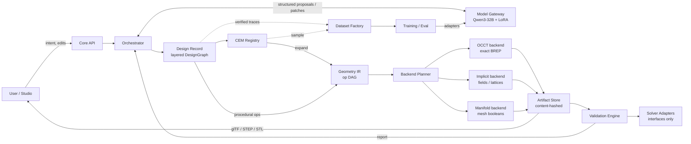
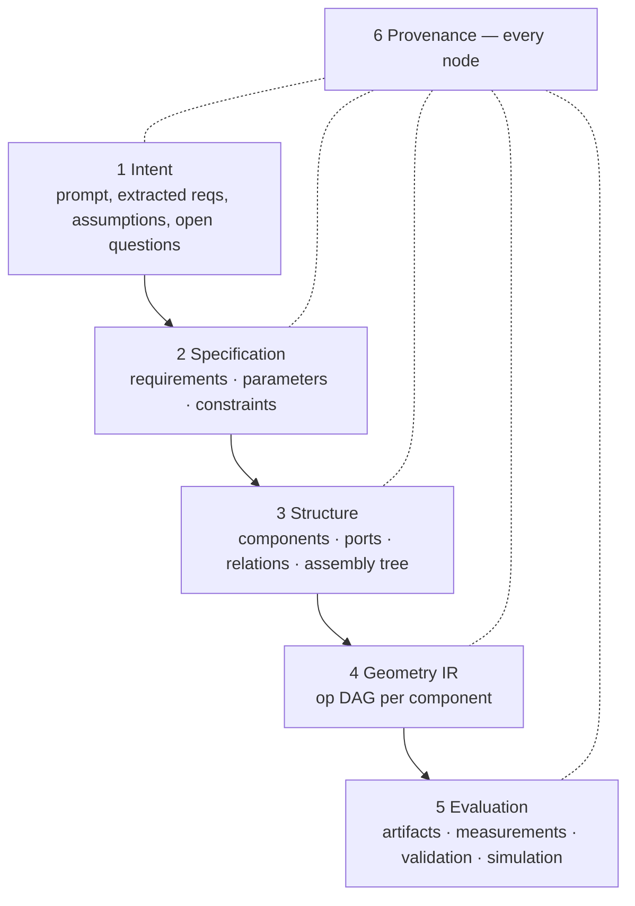
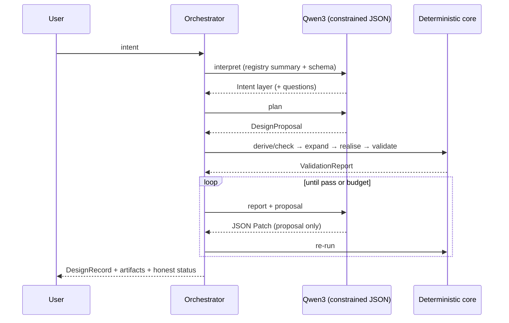
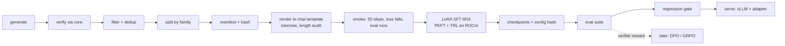

# Berkelium Architecture — Source of Truth

Status: **Proposal v0.1 (2026-10-05)**, post-reconnaissance, pre-implementation. Decisions are logged in `ARCHITECTURE_DECISIONS.md`; external sources in `SOURCES_AND_LICENSES.md`.

---

## 1. Current state (as inspected)

| Repo | What exists | What does not |
|---|---|---|
| `BERKELIUM-NEURAL-RENDERING-AND-SCIENCES` @50c1fa3 | 105 **zero-byte** files whose names are tools (`04-LLM-TRAINING/TRL`, …). README (7 KB) contains pasted chat text ("Bro, since the repo is brand new…"). | Any data, schema, generator, training script, config, or test. |
| `berkelium-studio` @ff7177c | FastAPI backend (`/health`, `/chat`, `/ocr`, `/pdf-ocr`) — well hardened (auth, rate limits, size caps, retries, request IDs). Electron + React + Vite shell. `three` and `@monaco-editor/react` installed. | Any frontend beyond the **stock Vite template** (`App.jsx` is the counter demo). No 3D viewer, no geometry, no design model. |
| Berkelium core | — | Does not exist. This repo (`berkelium-core`) is created for it. |

**Current Qwen path:** Studio backend → Fireworks AI `chat/completions` with a configured `model_id`; single-turn, `max_tokens=1024`, `temperature=0.7`, free text, system prompt describing a "Blender-style" coding assistant. No structured output, no schema, no tool loop, no MI300X involvement. Fine for chat, unusable for design generation as-is (too short, too hot, unconstrained, wrong role).

**Debt / risks found:** Electron `nodeIntegration: true` + `contextIsolation: false` (any rendered remote/LLM content gets Node access); `/pdf-ocr` is text extraction, not OCR (scanned PDFs return empty); no LICENSE in either team repo; training repo taxonomy is organised by *tool names* rather than by *pipeline stages*.

**LEAP 71 findings (summary; details §12):** PicoGK is a voxel/OpenVDB implicit kernel (C# over a C++ runtime). Its distributed native binaries cover **osx-arm64 and win-x64 only**; the runtime's CMake has WIN32/APPLE branches and Mac/Win install scripts — **Linux is unsupported upstream**. Their CEMs are C# programs with hard-coded parameters in static fields and viewer side-effects; engineering knowledge is encoded as *geometric construction strategy*, not as analysis. Neither published CEM performs thermal, structural or fluid calculation.

---

## 2. Target architecture



**Governing principle — authority separation.** The LLM may *propose* intent, requirements, CEM choice, parameters and procedural geometry. Only deterministic code may *write* realised geometry, measurements, validation and simulation results. This is enforced by schema (two schemas, §3.3), not by convention.

---

## 3. Design Record (the "DesignGraph")

I keep the name DesignGraph for the structural part but reject a single flat graph: requirements, geometry operations and evaluation results have different authors, lifetimes and trust levels. The record is **layered**.



### 3.1 Layers
1. **Intent** — raw prompt; extracted requirements each linked to the source text span; explicit *assumptions* the model made; *open questions* (ambiguities it should ask instead of guessing).
2. **Specification**
   - `Requirement`: quantity with unit, comparator, tolerance, `hard|soft`, priority, source (`user|derived|standard`).
   - `Parameter`: typed (`length`, `angle`, `count`, `enum`, `bool`, `material_ref`, `field_expr`), unit, bounds, default, `free|fixed|derived`.
   - `Constraint`: expression over parameters and *measured quantities* (`outer_d - bore_d >= 2*min_wall`), class ∈ {parametric, geometric, assembly, manufacturing, performance}.
3. **Structure** — `Component` = instance of a CEM (`cem: "gear.spur@0.1"`) **or** a procedural part (owns its op graph). `Port` = named frame + semantic type (`shaft_bore`, `fluid_port`, `bolt_pattern`, `mount_face`). `Relation` = `mate | mesh(gear) | fluid_connect | attach | pattern_of`. Assembly tree with placements.
4. **Geometry IR** — §5. For CEM components it is *generated*; for procedural components it is *authored* (by user or LLM).
5. **Evaluation** — system-written only: artifact hashes per backend, mass properties, validator results (§7), solver results (§8).
6. **Provenance** — on every node: `author ∈ {user, llm:<model>@<adapter>, cem:<name>@<ver>, system}`, timestamp, parent revision, content hash.

### 3.2 Cross-cutting choices
- **Stable node IDs** + revisions. Every edit — from the LLM, from a Studio slider, from an optimiser — is a **JSON Patch** against the previous revision. One edit path for humans and models; edit histories become correction-pair training data for free.
- **Units are explicit** (`{"value": 12, "unit": "mm"}`), validated with `pint`. Geometry kernels receive millimetres by convention; physics receives SI. Conversion happens at one boundary.
- **Expression language** (small, parsed AST, no `eval`) for constraints, derived parameters and *field functions*. This replaces ShapeKernel's C# delegates: modulations and SDFs become serialisable, diffable, LLM-authorable, and compilable to NumPy or PyTorch (GPU) later.
- **Schema versioning from day 1**, with migrations. Datasets are pinned to a schema version (risk R6).
- **Compact serialisation** for the model (references, defaults omitted) separate from the canonical record; assemblies will otherwise overflow context.

### 3.3 Two schemas
- `DesignProposal` — layers 1–4 only. The **only** thing the LLM emits (via constrained decoding). Cannot contain measurements or validation states.
- `DesignRecord` — full record, written by the core.

---

## 4. CEM framework

A CEM is a **versioned, pure, deterministic** Python package that turns requirements and parameters into geometry plus engineering checks.

```python
class CEM(Protocol):
    meta: CEMMeta                       # name, version, domain, summary, tags, references/standards
    Requirements: type[BaseModel]       # what a user can ask for (units, bounds)
    Parameters:   type[BaseModel]       # what the geometry needs
    ports: list[PortSpec]

    def derive(self, req: Requirements, ctx: Context) -> Derivation      # engineering sizing: req -> params (+ rationale)
    def check(self, p: Parameters, ctx: Context) -> list[Diagnostic]     # closed-form engineering checks, pre-geometry
    def expand(self, p: Parameters, ctx: Context) -> ComponentGeometry   # -> Geometry IR + port frames + face tags; no side effects
    def validators(self) -> list[Validator]                               # domain checks on realised geometry
    def analyses(self) -> list[AnalysisSpec]                              # what is analytic, what needs a solver, what is unsupported
    def sample(self, rng: Generator, mode: SampleMode) -> Parameters      # valid / boundary / invalid samples for dataset generation
```

Rules (each is a response to something observed in LEAP 71 code): no global or static state; no viewer/IO side effects; parameters are typed data, not subclass constants; variants are parameter presets, not subclasses; sub-CEMs compose through ports (a `ThreadedHoleCEM` used by a flange); registration by Python entry points so external packages add CEMs without touching core.

`derive` is where engineering knowledge lives (e.g. isentropic nozzle sizing, gear module from torque). A CEM without `derive` is a *parametric template* — useful, but the registry labels it as such so nobody mistakes geometry for engineering.

`sample` makes every CEM a **training-data factory** (§10).

---

## 5. Geometry IR and backends

### 5.1 IR
A DAG of typed operations; each op = `{id, op, args, inputs, tags}`. Op families:

| Family | Ops (initial → later) |
|---|---|
| Primitives | box, cylinder, cone, sphere, torus, prism |
| Curves & sketches | line, arc, polyline, bspline(control pts), involute, helix; closed profiles |
| Sweeps | extrude, revolve, sweep(profile, path, frames), loft |
| Booleans | union, difference, intersection |
| Modifiers | offset, shell, fillet, chamfer, smooth |
| Transforms | translate, rotate, mirror, scale, linear/polar/path patterns |
| Fields | sdf(expr), tpms(gyroid…), lattice(beams), modulated_shape(frame, modulation fields) — ShapeKernel-style |
| Assembly | instance(component, placement) |
| Interop | import(step/stl/mesh) |

Each op declares a **representation requirement**: `exact` (needs BREP), `field` (needs implicit), or `any`. Each output carries **semantic tags** (`tooth_flank`, `fluid_wall`) so validators and Studio can point at the geometry a result refers to.

### 5.2 Backend interface
```python
class GeometryBackend(Protocol):
    name: str; representation: Literal["brep","field","mesh"]
    def capabilities(self) -> set[OpKind]
    def execute(self, graph: GeometryGraph, opts: ExecOpts) -> Realization  # shape handles + per-op errors (typed)
    def measure(self, h: ShapeHandle) -> Measurements                      # volume, area, bbox, inertia, + tolerance
    def convert(self, h: ShapeHandle, to: Representation) -> ShapeHandle   # only lossy-allowed directions
    def export(self, h: ShapeHandle, fmt: Format) -> Artifact
```

**Planner rule:** BREP → mesh → field conversions are allowed; field → BREP is not (only to mesh). A design whose graph contains `field` ops can therefore not export STEP for those parts — the system says so rather than faking it. Every measurement records backend and tolerance (observed: same cube-minus-sphere = 833.0 mm³ in OCCT vs 840.9 mm³ in Manifold at 96 segments).

### 5.3 Backend selection (evidence in ADR-004)
| Role | Choice | Status |
|---|---|---|
| Exact BREP, STEP | **OCCT via OCP** (`cadquery-ocp`) | Verified on Linux |
| Mesh booleans, fast preview, level-set meshing | **Manifold** (`manifold3d`) | Verified on Linux |
| Implicit/fields at production resolution | Phase 1: Berkelium SDF evaluator (NumPy; PyTorch-ROCm later) + Manifold level sets. Phase 2 candidates: PicoGK as an out-of-process C# worker (requires our own Linux runtime build) or OpenVDB | Open (U2) |
| Rendering | three.js in Studio from glTF; Blender optional for offline renders | Never an authority |
| FreeCAD | Interop only | Rejected as kernel |

---

## 6. Manufacturing interface
`ManufacturingProfile` (process, machine envelope, min wall, min hole, max unsupported overhang, min feature, powder/resin drainage, tolerance class) is attached to a component or the design. Manufacturing validators read it; CEMs may read it in `derive` (HelixHeatX-style "make it printable" logic becomes profile-driven instead of hard-coded angles). Export adapters: STEP, STL, 3MF, glTF; slicing/CLI later.

## 7. Validation

| Level | Examples | Fidelity tag |
|---|---|---|
| L0 Schema | JSON schema, references resolve | rule |
| L1 Parameters | units, bounds, enum | rule |
| L2 Constraints | expression evaluation over params + measurements | rule |
| L3 Geometric | BREP valid, watertight, manifold, no self-intersection, non-empty | geometric |
| L4 Topology | body count, genus, domain connectivity (fluid A ∩ fluid B = ∅) | geometric |
| L5 Manufacturability | min wall (distance field), overhang, envelope, trapped voids | geometric |
| L6 Engineering analytic | gear undercut/contact ratio/Lewis stress; isentropic area ratio | analytic |
| L7 Simulation | FEA/CFD/thermal via adapters | numerical |

```python
class Validator(Protocol):
    id: str; version: str; level: int
    def applies_to(self, target: NodeRef, record: DesignRecord) -> bool
    def run(self, target, record, artifacts) -> ValidationResult
# ValidationResult: status ∈ {pass, fail, warn, not_evaluated, error}, measured, limit, tolerance,
#                   evidence (artifact ref / face tags), fidelity {kind, assumptions, standard}
```

`not_evaluated` is a first-class status. A design is never labelled "physically validated" unless an L7 result with numerical fidelity exists. Reports are deterministic and content-hashed so dataset examples can cite the exact report.

## 8. Simulation interface (interfaces only for now)
`SolverAdapter.prepare(record, AnalysisSpec) -> Case`, `.run(Case) -> SolverResult` with solver name/version, mesh statistics, convergence data, assumptions. Candidates: FEniCSx (library), CalculiX and OpenFOAM (GPL — external processes only). No adapter ships until it is validated against a reference case.

---

## 9. AI architecture



- **Model Gateway** abstraction: `FireworksProvider` (existing path, kept) and `VLLMProvider` (MI300X, ROCm, LoRA hot-swap). Both must support **schema-constrained decoding** (vLLM guided JSON) so L0 failures become rare and the model's capacity goes to engineering choices.
- Tasks are separate prompts/heads: `interpret`, `plan`, `repair`, `modify`, `explain`. They share one adapter initially; split if evaluation says so.
- CEM selection uses a registry summary in context; retrieval over CEM docs once the registry exceeds context.
- The LLM never computes engineering numbers that a CEM `derive` can compute; it chooses requirements and CEMs, and repairs from validator evidence.

## 10. Training and dataset architecture

### 10.1 Data sources (in order of trust)
1. **CEM-synthetic** — `sample()` → derive/expand/realise/validate. Labels are computed, not written.
2. **Perturbation/repair** — corrupt valid designs (bound violations, broken mates, thin walls) → validator report → target patch. Any patch that passes re-validation is accepted at eval time, not only the inverse perturbation.
3. **Procedural corpus** — grammar-sampled op graphs (novel geometry) with captions; executability checked by backends.
4. **Teacher-generated intents** — paraphrases and realistic prompts generated by a model, **kept only if the deterministic pipeline verifies the target**.
5. **Human gold set** — small, eval-only, never trained on.

### 10.2 Record (JSONL, one task per line)
`{id, schema_version, task, messages[], target, verification{report_hash, passed, validators[]}, source{generator, version, seed}, cem_refs[], family_id, split}`. Datasets are manifests of content hashes; splits are by **family_id / CEM**, plus a **held-out-CEM split** to measure generalisation to unseen engineering objects (random row splits would leak near-duplicates).

### 10.3 Pipeline


- **bf16 LoRA, not QLoRA, by default.** Qwen3-32B bf16 weights ≈ 65 GB; a single MI300X has 192 GB HBM, which should hold LoRA training with gradient checkpointing at multi-k sequence lengths (verify in smoke test). QLoRA's main enabler, bitsandbytes, has uneven ROCm support; quantisation also degrades the base we are trying to steer.
- **Metrics:** schema-valid %, executable %, validation-pass %, requirement satisfaction %, repair success within k rounds, parameter error vs. derived optimum, CEM-selection accuracy, held-out-CEM pass %, plus zero-shot baseline of the untuned model on the same suite.
- **The strategic edge:** validators are verifiers. Once SFT works, RL with verifiable rewards (pass/fail, requirement satisfaction) is available without human labelling.

## 11. Studio / Core boundary

Core owns: design records, CEMs, geometry, validation, simulation, model calls, datasets. Studio owns: interaction, rendering, inspection, parameter editing, result display. **Studio never calls the LLM directly and never computes engineering.**

| Endpoint (v1, proposed) | Purpose |
|---|---|
| `GET /v1/schema/{name}` | Canonical JSON Schemas; Studio generates TS types from them |
| `GET /v1/cems`, `GET /v1/cems/{id}` | Registry + parameter JSON Schema → auto-generated parameter panels |
| `POST /v1/sessions/{id}/intents` | Natural-language request → job |
| `GET /v1/jobs/{id}/events` (SSE) | Streamed stages: interpreting, planned, realising, validated, repairing |
| `GET /v1/designs/{id}?rev=` | DesignRecord |
| `PATCH /v1/designs/{id}` | JSON Patch (user edits use the same path as model edits) → new revision |
| `GET /v1/artifacts/{hash}.{glb,step,stl}` | Content-addressed geometry |
| `GET /v1/designs/{id}/validation` | Report with face-tag evidence for overlays |

Existing Studio backend endpoints: `/chat` moves behind the Core model gateway; `/ocr` and `/pdf-ocr` become Core *document ingestion* (requirements from spec sheets).

## 12. Research findings — LEAP 71 in detail
- **PicoGK** (~18.8 k C# lines): `Voxels` offers add/subtract/intersect, offset/double/triple offset, fillet, smoothen, shell, render mesh/implicit/lattice, mass properties, closest point, normals. Booleans on voxels essentially cannot fail — the property CAD kernels lack — at the cost of resolution-bound precision and no BREP/STEP.
- **ShapeKernel** (~11.2 k lines): `BaseShape` → `voxConstruct()`, with `IMeshBaseShape`/`ISurfaceBaseShape`/`ISpineBaseShape`/`ILatticeBaseShape`; shapes defined in `LocalFrame`s with normalised ratios; dimensions given by `SurfaceModulation(φ, t)`; vertex transformation hooks. **Adopted idea:** frame-parameterised modulated shapes as an IR op family with *data-defined* modulations.
- **RoverWheel** (~2.2 k lines): the "engineering" is a conformal mapping that warps layered rings into a lens-shaped wheel volume; parameters are `static` fields set in subclass constructors (`Wheel_01`: 120/30/60 mm). No load, traction or material reasoning. It is a strong *geometry* exemplar and a weak *engineering* proof.
- **HelixHeatX** (~1.7 k lines): two fluid domains made disjoint by mutual offset subtraction (0.8 mm wall), ports as frames, lattice supports and a print web for AM. No ε-NTU, pressure-drop or structural calculation. Architecturally richer (multi-domain, ports, verifiable topology invariant).

## 13. Proposed directory structure (core)
```
berkelium-core/
  berkelium/
    schema/        # pydantic models, JSON Schema export, migrations
    expr/          # expression language: parser, units, evaluators (numpy; torch later)
    geometry/      # IR, planner, backends/{occt,manifold,implicit}
    cem/           # protocol, registry, library/{gear,nozzle,...}
    validation/    # engine, validators by level
    simulation/    # adapter interfaces
    manufacturing/
    ai/            # model gateway, prompts, orchestrator
    api/           # FastAPI
  datasets/        # generators, verification, manifests (data itself out of git)
  training/        # configs, SFT/eval scripts, regression suite
  tests/
  docs/
```

## 14. Risks
| ID | Risk | Mitigation |
|---|---|---|
| R1 | PicoGK has no Linux runtime | Core does not depend on it; optional worker later |
| R2 | Designs needing both STEP and lattices | Planner makes representation explicit; hybrid outputs (BREP shell + mesh infill) documented |
| R3 | OCCT boolean/fillet failures | Typed errors, retries with tolerance, fallback to mesh; failures become training signal |
| R4 | Synthetic prompts ≠ real users | Teacher paraphrase, human gold set, eval on gold only |
| R5 | Novel geometry is hard to learn | IR expressivity vs learnability measured on procedural corpus early |
| R6 | Schema churn invalidates data | Versioning + migrations + regeneration from generators (data is code-derived) |
| R7 | "Passes validation" ≠ good design | Requirement-satisfaction metrics, explicit not_evaluated |
| R8 | ROCm stack variance (vLLM, attention kernels) | Pin container; smoke tests before runs |
| R9 | Schema drift across 3 repos / 2 owners | Single schema source in core, generated TS types |
| R10 | Context length for assemblies | Compact serialisation, references, per-component calls |
| R11 | MI300X access may be time-limited | Make every stage runnable on CPU/small models; checkpoint + dataset portability |

## 15. Unresolved questions
See `ARCHITECTURE_DECISIONS.md` § Open decisions (U1–U9).
